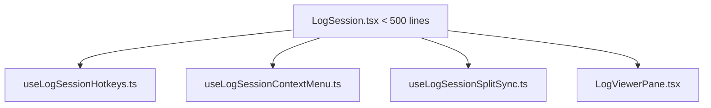

# 📋 LogSession.tsx 500줄 초과 파일 분할 리팩토링 계획서 🐧⚡

형님! `components/LogSession.tsx` 파일은 현재 1,698줄로 단일 책임 원칙(SRP) 관점에서 지나치게 비대하여 가독성과 유지보수성이 저하되고 있습니다. 
이번 연동 최종 마무리 작업의 타입 에러 해결 이후, 시스템의 절대적인 안정성을 보장하면서도 이 거대한 코드를 날씬하고 세련되게 분리하기 위한 리팩토링 상세 계획을 보고드립니다!

---

## 🚨 현상 및 문제점 분석
- **현 상태**: 파일 크기 **1,698줄**.
- **원인**:
  - Alt + 1~9 전역 단축키 수신기 및 핸들러 로직 포함.
  - 마우스 우클릭을 통한 Context Menu, 로그 아카이브 저장, 새 탭 열기 등의 UI 연동 로직의 집중.
  - 듀얼 뷰 간의 스크롤 동기화, 화면 드래그 리사이즈 등의 다차원 인터랙션 이벤트 핸들링 누적.
- **영향**:
  - 미세 수정 시 전체 파일 컴파일 및 리렌더링 영향 범위 분석이 까다로움.
  - UI 레이아웃 선언부와 복잡한 이벤트 콜백이 뒤섞여 있어 가독성이 떨어짐.

---

## 🛠️ 분리 설계 아키텍처 (Proposed Micro-hooks)

리팩토링은 기능 수정 없이 순수한 코드 격리(Safe Extraction)만 수행하며, React Hook의 격리 구조를 활용해 500줄 이하로 분할합니다.

### 1. 전역 단축키 훅 격리 (`hooks/useLogSessionHotkeys.ts`)
- **이동 대상**: `Alt + 1~9` 퀵 커맨드 단축키 수신을 위한 `useEffect` 구문 및 `PromptDialog` 연동 상태.
- **기대 효과**: 단축키 결합 로직을 별도로 관리하여 입력 필드 버그(IME 문제 등) 차단 및 100줄 감소.

### 2. 마우스 콘텍스트 메뉴 및 저장 훅 격리 (`hooks/useLogSessionContextMenu.ts`)
- **이동 대상**: `handleContextMenu`, `handleUnifiedSave`, `handleOpenInNewTab`, `onArchiveSaveLeft`, `onArchiveSaveRight` 등.
- **기대 효과**: 복잡한 아카이브 및 PID/TID 추출 우클릭 메뉴를 집중 관리하여 250줄 이상 대폭 절감.

### 3. 화면 리사이즈 및 스크롤 동기화 훅 격리 (`hooks/useLogSessionSplitSync.ts`)
- **이동 대상**: `handleSyncScroll`, `handleSplitAnimateStart`, `handleAnalyzerResizeStart` 등 스플릿 뷰 및 분석 대시보드 리사이징 이벤트.
- **기대 효과**: 리사이즈 시 화면 전체에 걸리는 마우스 드래그 리스너 처리를 격리하여 성능을 높이고 150줄 감소.

---

## 🛡️ 안전 검증 계획 (Safe Transition)
1. **Regression zero**: 리팩토링 진행 단계마다 `wsl npx tsc --noEmit`을 수행해 컴파일 정상 작동을 매 순간 확인합니다.
2. **Context API 보존**: `useLogContext()`의 컨텍스트 필드 구조는 일체 건드리지 않고, 단순 Props 전달 브릿지만 Hook으로 추출하여 결합도를 최소화합니다.

---

**형님! 최고의 성능과 명품 아키텍처를 위해 한 땀 한 땀 정성을 다하겠습니다! 🐧💎**
