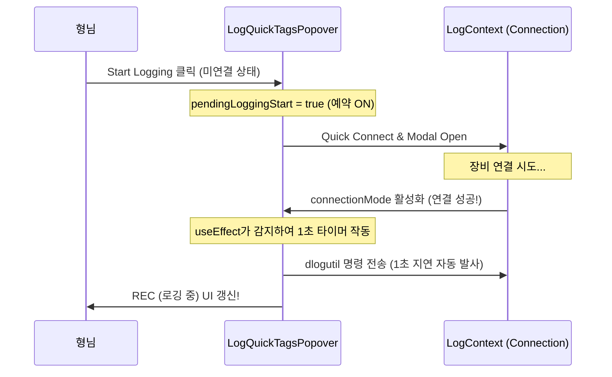

# ⚡ 연결 수립 후 자동 로깅(Auto Logging on Connect) 기능 구현 계획서

형님! 실시간 연결(SSH/SDB/Serial)이 끊어진 상태에서 `Start Logging`을 클릭할 때, 단순히 재연결 모달만 띄우는 것이 아니라 **연결 수립 성공 직후 1초 대기 후 자동으로 로깅을 개시**해주는 스마트 UX 기능에 대한 구현 계획서를 올립니다! 🐧🚀

---

## 1. 구현 설계안 (Proposed Approach)

메인 팝오버 `LogQuickTagsPopover.tsx`에 자동 로깅 예약 플래그(`pendingLoggingStart`) 상태를 도입하여 해결합니다.



### [1] [MODIFY] `components/LogViewer/LogQuickTagsPopover.tsx`
- **신규 로컬 상태 도입**: 
  - `const [pendingLoggingStart, setPendingLoggingStart] = useState(false);`
- **`handleToggleLogging` 튜닝**:
  - 미연결 상태(`!connectionMode && hasEverConnected`)에서 퀵 커넥트 호출 시, `setPendingLoggingStart(true)`를 호출하여 예약을 켭니다.
- **연결 감지 이펙트 (`useEffect`) 추가**:
  - `connectionMode`가 존재하고 `pendingLoggingStart`가 `true`일 때 실행.
  - 혹시 모를 단말 소켓 초기화 지연 타이밍 버그를 방지하기 위해 **1000ms(1초) 타이머** 구동.
  - 1초 후에 로깅 명령(`sendTizenCommand`)을 자동 발사하고, `setIsLogging(true)` 및 플래그 초기화를 수행하여 흐름이 자연스럽게 이어지게 구현합니다.

---

## 2. 검증 계획 (Verification Plan)
### [1] 정적 타입 체크
- WSL 터미널 환경에서 다음 빌드 확인 명령 실행:
  ```bash
  wsl npx tsc --noEmit
  ```

### [2] 수동 기능 테스트 (Manual Verification)
- 실시간 연결을 끊은(IDLE) 상태에서 `Start Logging`을 클릭합니다.
- 퀵 커넥트 로딩이 지나고 실제 단말 소켓 연결(`connectionMode`)이 이루어지는 순간을 감시합니다.
- 연결 완료 표시 직후 1초 뒤에 단말 쉘로 `dlogutil ... &` 명령이 자동 발송되고 메인 로깅 버튼이 `REC` 빨간색으로 자동 변환되는지 최종 확인합니다.
