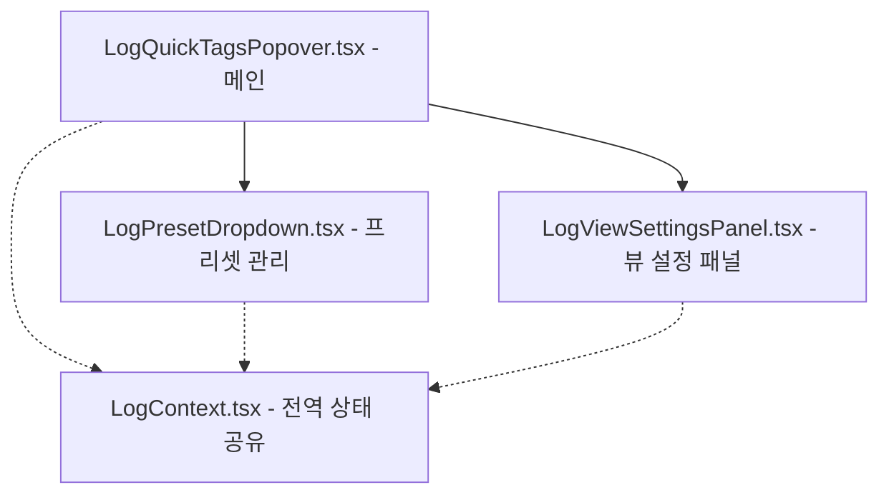

# 🛠️ Log Control Center (LogQuickTagsPopover) 거대 파일 분리 리팩토링 계획서

형님! `LogQuickTagsPopover.tsx` 파일이 현재 **722줄**로 500줄 초과 방지 규칙을 위반하고 있습니다. 
Zero Regression과 60fps 무결성 유지를 보장하면서, 단일 책임 원칙(Single Responsibility Principle)에 따라 이를 컴팩트하게 쪼개는 계획서를 올립니다! 🐧⚡

---

## 1. 개요 및 리팩토링 목표
- **현황**: `LogQuickTagsPopover.tsx`에 로그 제어, 태그 입력, 프리셋(Dropdown) 관리, 뷰 설정(폰트, 간격, 불투명도, 레벨 필터) 등 너무 많은 역할이 통합되어 있음 (722줄).
- **목표**: 500줄 이하로 파일 다이어트를 진행하여 코드의 가독성을 높이고 향후 유지보수성을 극대화함.
- **예상 감축 수준**: 메인 파일을 약 **300~350줄** 수준으로 대폭 축소.

---

## 2. 모듈 분리 설계안

`useLogContext()`를 전역적으로 활용하고 있으므로, 하위 컴포넌트도 Context를 공유하도록 유연하게 분리하여 Props 전달을 최소화합니다.



### [1] [NEW] `components/LogViewer/LogPresetDropdown.tsx`
- **역할**: 스마트 프리셋 드롭다운 UI, 프리셋 저장 팝업, 프리셋 목록 불러오기/저장 로직 관리.
- **주요 기능**:
  - `customPresets` 상태 관리 및 `localStorage` 영구 연동.
  - 프리셋 적용(`handleApplyPreset`), 신규 프리셋 임시 팝업 저장(`handleSavePreset`), 프리셋 삭제(`handleDeletePreset`) 로직 캡슐화.
  - UI 렌더링: 12px 드롭다운 프리셋 선택기, 삭제 휴지통 아이콘, 프리셋 저장 미니 폼.

### [2] [NEW] `components/LogViewer/LogViewSettingsPanel.tsx`
- **역할**: 우측 Quick View Settings 슬라이딩 패널 UI 및 렌더링 옵션 제어.
- **주요 기능**:
  - 폰트 스타일/사이즈 조절 컨트롤.
  - 라인 간격 조절 슬라이더.
  - 라인 번호 보이기/숨기기 토글.
  - 필터 바이패스 (Bypass Filters) 토글.
  - 로그 레벨별 불투명도(Opacity) 슬라이더.
  - 로그 레벨별 켜기/끄기 토글 및 컬러 피커 연동.

### [3] [MODIFY] `components/LogViewer/LogQuickTagsPopover.tsx`
- **역할**: 메인 팝오버 제어 및 로깅 코어 제어.
- **주요 기능**:
  - 팝오버 열기/닫기 (`isOpen`), 가로 너비 확장 상태 (`isExpanded`) 관리.
  - Target Log Tags 인라인 칩 입력 및 삭제 제어.
  - Live Command Preview 및 실시간 템플릿 명령어 에디터 소유.
  - Start / Stop Logging 토글 실행 (300ms pkill dlogutil 명령 포함).
  - 분리된 `LogPresetDropdown` 및 `LogViewSettingsPanel`을 마운트하여 팝오버 레이아웃 조립.

---

## 3. 검증 계획
### [1] 정적 검증 (TypeScript)
- WSL 환경에서 다음 빌드 확인 명령 실행:
  ```bash
  wsl npx tsc --noEmit
  ```
- 신규 추출된 파일들의 임포트 경로 및 전역 Context 타입 호환성 철저 검증.

### [2] 동적/수동 검증
- **프리셋 기능**: 태그 추가 후 세이브 버튼을 누르고 프리셋을 저장 및 삭제하여 `localStorage`와 드롭다운 리스트가 즉시 동기화되는지 검수.
- **설정 기능**: Font Size, Line Spacing 슬라이더, Opacity 슬라이더 조절 시 캔버스 로그 화면에 버벅임이나 깜빡임 없이 실시간 60fps 무결성 반영이 확인되는지 검수.
- **로깅 토글 기능**: Start/Stop Logging이 에러 없이 깔끔하게 동작하는지 검수.

---

## 4. APP_MAP.md 업데이트 계획
- `important/APP_MAP.md`의 `LogQuickTagsPopover` 관련 상세 사양에 신규 컴포넌트 `LogPresetDropdown.tsx` 및 `LogViewSettingsPanel.tsx` 분리 구조 및 협력 관계를 명시하여 아키텍처 문서를 완벽 최신화.
