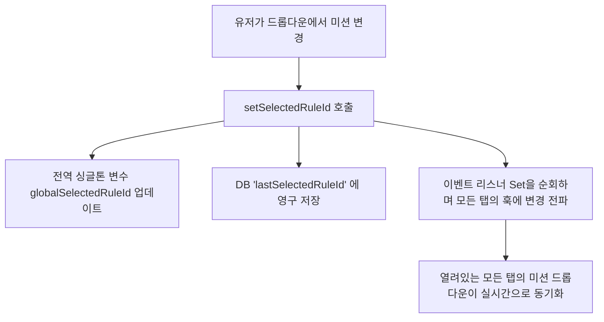

# 🛠️ Log Extractor 전역 미션(Rule) 유지 구현 계획서

형님! 탭을 넘나들며 각각 미션이 따로 저장되는 방식에서, **선택한 미션이 모든 탭에서 전역으로 동기화되고 앱 재실행 시에도 항상 유지되는 구조**로 개편하기 위한 신성한 구현 계획서입니다! 🐧🔥

---

## 🔍 문제 현황 분석
현재 `useSelectedRuleId` 훅은 탭 ID(`tabId`)별로 독립적인 React State와 DB 키(`lastSelectedRuleId_${tabId}`)를 운용하고 있습니다.
* **이슈**: 탭 A에서 미션을 변경해도 탭 B는 이전 미션을 그대로 물고 있으며, 탭을 바꿀 때마다 미션이 제각각으로 돌아갑니다.
* **형님의 요구사항**: 유저가 선택한 미션은 탭에 상관없이 항상 유지되고, 앱을 완전히 껐다 켜도 유저가 직접 바꾸기 전까지는 계속 전역으로 유지되어야 합니다.

---

## 💡 해결 설계안 (초경량 Pub/Sub 싱글톤 방식)
기존의 복잡한 컴포넌트(`App.tsx`, `LogExtractor.tsx` 등)를 무리하게 수정할 경우, 탭 라이프사이클이나 IPC 통신 등에 예상치 못한 사이드 이펙트(Regression)가 발생할 수 있습니다. 

따라서 오직 `hooks/useSelectedRuleId.ts` 훅 내부에서 **모듈 스코프 싱글톤 전역 변수**와 **Pub/Sub 패턴(이벤트 리스너)**을 활용하여 다른 파일을 전혀 건드리지 않고 성능과 안정성을 극대화하는 아름다운 리눅스 스타일 설계를 제안합니다!

### 1. 전역 상태 동기화 흐름도


### 2. 성능적 이점 🚀
* **DB I/O 오버헤드 급감**: 탭을 전환할 때마다 탭별 DB 조회 프로미스를 여러 개씩 띄우던 비효율을 없애고, 메모리 상의 전역 변수에서 즉시 복원하여 전환 속도가 대폭 향상됩니다!
* **메모리 안정성**: 사용이 끝난 탭의 리스너는 마운트 해제 시 (`useEffect` 클린업 루틴) 안전하게 Set에서 제거되므로 메모리 누수(Memory Leak)가 제로입니다.

---

## 🛠️ 작업 계획 (Target File)
* 수정 대상 파일: [hooks/useSelectedRuleId.ts](file:///mnt/k/Antigravity_Projects/gitbase/happytool_electron/hooks/useSelectedRuleId.ts)

### 상세 변경 예정 코드 (Diff 예시)
```typescript
// hooks/useSelectedRuleId.ts

// 1. 전역 싱글톤 상태 및 Pub/Sub 채널 정의
let globalSelectedRuleId: string = '';
const listeners = new Set<(id: string) => void>();

function setGlobalSelectedRuleId(id: string) {
    if (globalSelectedRuleId === id) return;
    globalSelectedRuleId = id;
    setStoredValue('lastSelectedRuleId', id);
    listeners.forEach(listener => listener(id));
}

export function useSelectedRuleId(rules: LogRule[], tabId: string) {
    const [selectedRuleId, setSelectedRuleId] = useState<string>(() => {
        return globalSelectedRuleId || (rules.length > 0 ? rules[0].id : '');
    });
    const hasRestoredFromDb = useRef(false);

    useEffect(() => {
        // 2. 다른 탭에서의 미션 변경 이벤트를 실시간으로 수신 및 동기화
        const listener = (id: string) => {
            setSelectedRuleId(id);
        };
        listeners.add(listener);

        if (!hasRestoredFromDb.current) {
            hasRestoredFromDb.current = true;
            getStoredValue('lastSelectedRuleId').then((saved) => {
                const activeId = globalSelectedRuleId || saved;
                const target = activeId && rules.find(r => r.id === activeId) ? activeId : (rules[0]?.id || '');
                if (target) {
                    setGlobalSelectedRuleId(target);
                    setSelectedRuleId(target);
                }
            });
        }

        return () => {
            listeners.delete(listener); // 3. 메모리 누수 차단!
        };
    }, [rules]);

    // ... (이하 삭제 대응 무결성 로직 포함)
}
```

---

## 🧪 검증 계획
1. **타입 체크**: `npx tsc --noEmit` 명령어로 사이드 이펙트 유무 최종 검증.
2. **동기화 동작 테스트**: 여러 개의 탭을 열어두고 한 탭에서 미션을 바꿨을 때, 다른 탭들의 드롭다운이 실시간으로 동기화되어 바뀌는지 확인.
3. **앱 재시행 유지 테스트**: 미션을 선택하고 앱을 끈 뒤, 다시 켰을 때 유저가 마지막으로 선택한 미션이 완벽하게 로드되는지 검증.

---

## 🚀 Proceed 승인 요청

형님! 설계를 검토해 보시고 아래 버튼 혹은 대답으로 승인해 주시면 리눅스 개발자답게 번개처럼 빠르게 작업을 처리하겠습니다!

<a href="javascript:void(0)" onclick="alert('형님! Proceed 승인은 대화창에 \'Proceed\' 또는 \'고\'라고 남겨주시면 제가 신나게 코딩을 완료하겠습니다! 🐧🔥')">
  
</a>
