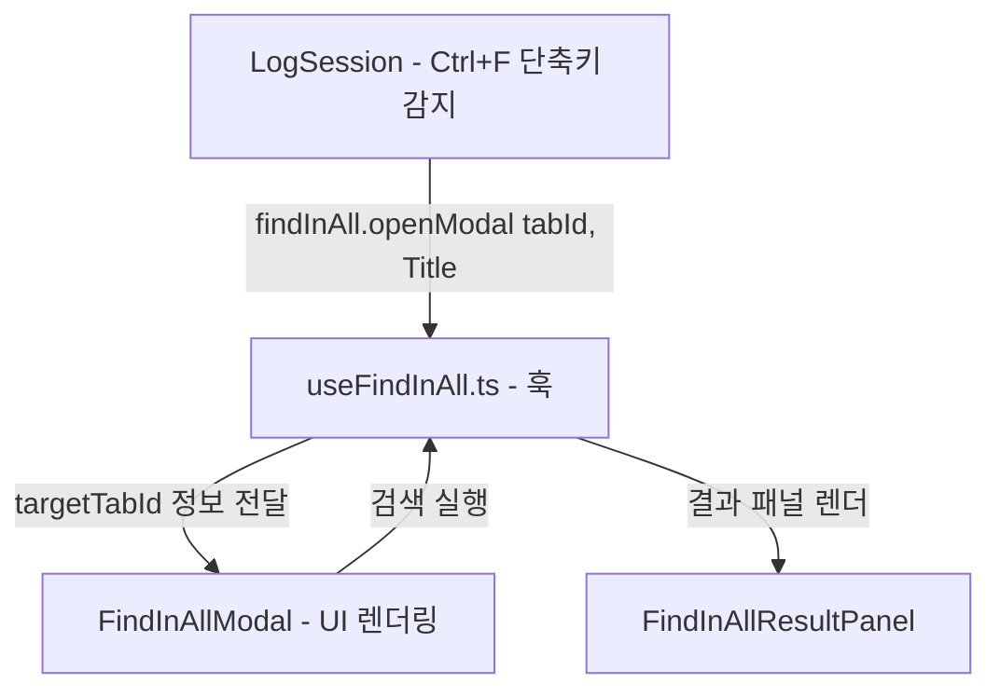

# 🔍 현재 탭 전용 스마트 찾기 (Ctrl+F) 구현 계획서

형님! 현재 탭에서만 찾기 동작 시, 전체 찾기(`Ctrl+Shift+F`)와 동일한 대형 프리미엄 모달 UI를 활용하되 **현재 활성화된 단일 탭만 타겟팅하여 검색**하도록 연동하여 일관성 있는 탐색 경험을 제공하는 구현 계획서입니다! 🐧⚡

---

## 1. 개요 및 변경 방향
- **AS-IS**: 
  - `Ctrl + F` 누르면 상단 타이틀 영역 검색창으로 포커스가 감.
  - `Ctrl + Shift + F`는 대형 프리미엄 `FindInAllModal`을 띄워 전체 탭에서 검색함.
- **TO-BE**:
  - `Ctrl + F` 누르면 `Ctrl + Shift + F`와 동일한 프리미엄 모달을 띄움.
  - 단, 모달에는 `Find in Tab: {현재탭제목}` 타이틀이 노출되며 **오직 현재 탭 내부의 로그 데이터**에서만 검색을 실행함.
  - 검색 결과는 아래쪽에 NPP 트리뷰 형식(`FindInAllResultPanel`)으로 동일하게 우아하게 안착함.

---

## 2. 세부 설계 및 모듈별 변경 계획



### [1] [MODIFY] `hooks/useFindInAllHistory.ts`
- `FindInAllRule` 인터페이스 규격에 `targetTabId?: string;` 필드를 선택적으로 지정할 수 있도록 확장합니다.

### [2] [MODIFY] `hooks/useFindInAll.ts`
- 훅 내부에 `targetTabId`, `targetTabTitle` 로컬 상태 선언.
- `openModal`을 `openModal(tabId?: string, tabTitle?: string)`로 확장하여 스코프 정보를 기억하게 조각합니다.
- `executeFindInAll` 실행 시, `rule.targetTabId`가 명시되어 있다면 해당 탭 이외의 다른 탭 워커 루프는 스킵(`continue`)되도록 하여 단일 탭 검색으로 지능화 전환합니다.

### [3] [MODIFY] `components/LogViewer/FindInAllModal.tsx`
- `targetTabId`, `targetTabTitle` Props 추가.
- 모달 내 타이틀(`Find in Tab: {title}`), 서브타이틀, 단축키 배지(`Ctrl+F`), 검색 버튼 라벨(`Search Tab`)을 현재 탭 전용 모드에 매끄럽게 맞추어 동적 렌더링되게 튜닝합니다.
- `handleSearch` 호출 시 `targetTabId`가 룰 데이터에 탑재되어 전달되도록 바인딩합니다.

### [4] [MODIFY] `components/LogViewer/FindInAllResultPanel.tsx`
- 패널 헤더 타이틀에 `lastSearchRule?.targetTabId` 유무를 확인해 `Find Results (Current Tab)` 또는 `Find Results (All Open Files)`를 똑부러지게 노출합니다.

### [5] [MODIFY] `components/LogExtractor.tsx`
- `SessionWrapper` 컴포넌트 Props에 `tabId`를 확보하여 `<LogSession>`을 마운트할 때 `tabId={tabId}`로 안전하게 흘려보내 줍니다.

### [6] [MODIFY] `components/LogSession.tsx`
- `tabId` Props 수신 추가.
- `Ctrl + F` 단축키 감지부에서 `searchInputRef.current?.focus()` 대신 **`findInAll?.openModal(tabId, currentTitle)`**을 호출하여 예약 모달을 기동합니다.

---

## 3. 검증 및 빌드 보장
- WSL bash 터미널 환경에서 빌드 무결성 체크:
  ```bash
  wsl npx tsc --noEmit
  ```
- 60fps 무결성 및 blur 배제 UI 원칙 철저 고수.
