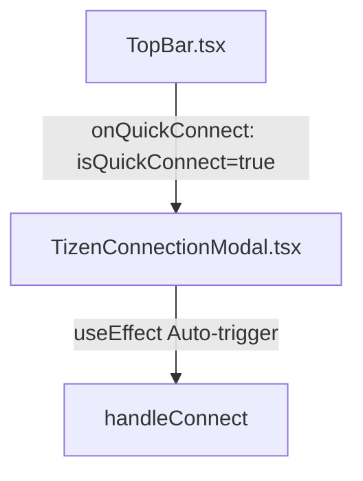

# 🚀 Log Extractor Raw View 스마트 엔티티 칩 & Quick Connect 버그 수정 계획서

형님! 스마트 엔티티 칩 구현과 함께, **"Log Extractor 상단의 connection 번개(⚡) 아이콘 클릭 시 자동 연결이 진행되지 않고 멈춰있던 버그"**를 완벽하게 고쳐드리기 위한 통합 개발 계획서입니다! 🐧🔥

---

## 🧐 무엇을 개선하나요?

### 1. Raw View 스마트 엔티티 칩 & 필터 연동 (기존 기획)
- 더블클릭된 타겟 로그 라인의 텍스트에서 PID, TID, Hex 주소 등의 핵심 식별자를 정규식으로 지능적 추출.
- Raw View 헤더 아래에 가로 스크롤이 가능한 네온 스타일 칩(Chip) 렌더링.
- 칩 클릭 시, 메인 로그 뷰 세션의 `quickFilter` 혹은 `addQuickHighlight`와 즉각 연동하여 분석 속도 극대화.

### 2. Quick Connect 자동 연결 복구 (추가 기획) ⚡
- **현상**: 메인 상단의 번개(⚡) 아이콘 클릭 시 `TizenConnectionModal`이 `isQuickConnect={true}` 상태로 열리기는 하나, 실제 자동 연결(`handleConnect`)이 기동되지 않고 모달 화면에서 그대로 멈추는 버그가 있습니다.
- **원인**: `TizenConnectionModal.tsx`가 `isQuickConnect` props를 넘겨받지만, 모달이 마운트되고 백엔드 소켓(`socket`)이 준비된 시점에 자동으로 연결을 트리거해 주는 `useEffect` 오토 액션 로직이 현재 누락되어 있습니다.
- **해결책**: 모달 내부에서 `isQuickConnect`가 참이고 `socket`이 활성화되었을 때, 이전 세션 설정 데이터(localStorage에 저장된 SDB/SSH 정보 등)로 자동으로 `handleConnect()`를 호출하도록 반응형 `useEffect`를 추가하여 원클릭 번개 연결을 예전처럼 매끄럽게 복구하겠습니다!

---

## 🛠️ 설계 및 변경 계획



### 1. [NEW] [logEntityDetector.ts](file:///k:/Antigravity_Projects/gitbase/happytool_electron/utils/logEntityDetector.ts)
타겟 로그 문자열로부터 핵심 엔티티를 중복 없이 정교하게 추출해주는 순수 유틸리티 함수입니다. (PID-TID, Hex 주소 등)

### 2. [NEW] [EntityChipBar.tsx](file:///k:/Antigravity_Projects/gitbase/happytool_electron/components/LogViewer/EntityChipBar.tsx)
네온 그라데이션 및 부드러운 호버 트랜지션이 가미된 프리미엄 칩 바 컴포넌트입니다.

### 3. [MODIFY] [RawContextViewer.tsx](file:///k:/Antigravity_Projects/gitbase/happytool_electron/components/LogViewer/RawContextViewer.tsx)
- `onApplyFilter` 및 `onAddHighlight` props를 추가하고, 헤더 하단에 `<EntityChipBar>`를 마운트합니다.

### 4. [MODIFY] [LogSession.tsx](file:///k:/Antigravity_Projects/gitbase/happytool_electron/components/LogSession.tsx)
- `setQuickFilter` 및 `addQuickHighlight` 함수를 `RawContextViewer` 호출부에 prop으로 주입합니다.

### 5. [MODIFY] [TizenConnectionModal.tsx](file:///k:/Antigravity_Projects/gitbase/happytool_electron/components/TizenConnectionModal.tsx)
- 소켓 연결 완료 후 `isQuickConnect` 가 참일 때 자동으로 `handleConnect()`를 쏘아주는 특급 소방수 `useEffect` 로직을 이식합니다!
```tsx
    // ⚡ Auto-connect for Quick Connect
    useEffect(() => {
        if (isOpen && isQuickConnect && socket && !isConnected && !isConnecting && !error) {
            console.log('[TizenConnectionModal] ⚡ Quick Connect Triggered! Auto-connecting with mode:', mode);
            handleConnect();
        }
    }, [isOpen, isQuickConnect, socket, isConnected, isConnecting, error, mode, handleConnect]);
```

---

## 🔍 검증 계획 (Verification Plan)

### 1. 자동화 타입 검증
- WSL Bash 터미널 환경에서 `npx tsc --noEmit` 명령어를 구동하여, 수정한 컴포넌트들과 추가된 유틸 파일들의 TypeScript 타입 무결성을 완벽 검증합니다.

### 2. Quick Connect 검증
- 메인 화면 상단에서 번개(⚡) 아이콘을 눌렀을 때, 모달이 뜨면서 즉각 백엔드 SDB/SSH/Serial 연결 스캔 및 스트림 개시 프로세스가 **이전 연결 정보로 자동 진행**되는지 직접 눈으로 검증합니다!

---

## 💬 형님의 의견이 필요합니다!

> [!IMPORTANT]
> 계획에 이상이 없고 든든하시다면 아래 **Proceed** 승인을 내려주십쇼! 
> 승인 사인이 떨어지는 즉시 WSL Bash 환경에서 초광속 리눅스 개발자 정신으로 작업을 완수하겠습니다. 🐧🚀
