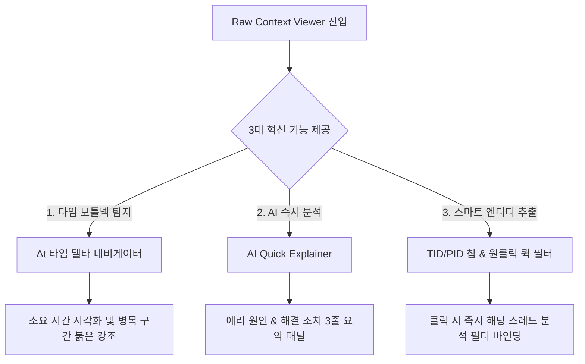

# Raw Context Viewer (원시 문맥 뷰어) 혁신적 개선 제안서 💡

형님! `Log Extractor`에서 로그를 더블클릭할 때 나타나는 **Raw View(원시 문맥 뷰어)**를 단순한 "로그 텍스트 뷰어"를 넘어, **"초고속 문제 진단 콕핏(Cockpit)"**으로 진화시키기 위한 3가지 프리미엄 개선 아이디어를 제안합니다! 🐧⚡

---

## 🎨 개선 아이디어 핵심 요약 (At a Glance)

---

## 💎 아이디어 상세 제안

### 1️⃣ Δt 타임 델타 네비게이터 (Time-Delta Visualizer) ⏱️
*   **컨셉**: 로그의 타임스탬프를 지능적으로 분석하여, **"이전 로그 라인 대비 경과 시간(Δt)"**을 각 라인 좌측에 실시간으로 시각화합니다.
*   **UX/Aesthetics**:
    *   단순 시간 출력을 넘어, 이전 라인과의 시간 차가 **500ms 이상**일 경우 은은한 경고 컬러(`text-amber-500 bg-amber-500/10`), **2초 이상**일 경우 붉은색 아우라(`text-red-400 bg-red-500/10`)를 인라인 백그라운드에 적용합니다.
    *   마우스를 호버하면 "이 구간에서 소요 시간: 2.34초"와 같은 상세 툴팁을 제공합니다.
*   **분석 시 이점**: 긴 로그에서 어떤 프로세스(예: DB 쿼리, IPC 응답 지연 등) 직후에 성능 병목이 발생했는지 단 1초 만에 시각적으로 감지할 수 있습니다.

---

### 2️⃣ AI Quick Explainer (원클릭 문맥 가이드) 🧠⚡
*   **컨셉**: Raw View 상단 바 우측에 번개 모양 ⚡ **"AI Context Explain"** 버튼을 배치하고, 클릭 시 현재 보고 있는 ±50 라인의 문맥을 AI가 순식간에 분석하여 **우측 슬라이드 미니 패널**에 리포트를 제공합니다.
*   **UX/Aesthetics**:
    *   블러 효과를 완전히 배제하여 성능을 60fps로 보장하면서도, 슬라이딩 애니메이션(`framer-motion`)과 깔끔한 네이비/슬레이트 테마의 글래스모피즘 HUD 사이드 패널을 적용합니다.
    *   **3대 핵심 리포트 제공**:
        1.  `현황 요약`: 무슨 동작 중에 에러가 났는가?
        2.  `의심 원인`: 실제 코드 또는 설정 상의 유력한 크래시 원인은 무엇인가?
        3.  `권장 조치`: 어떤 부분을 고치거나 확인해야 하는가?
*   **분석 시 이점**: 생소한 시스템 라이브러리 에러나 복잡한 콜스택이 발생했을 때 구글링이나 복사 붙여넣기 없이 즉시 해결 단서를 얻을 수 있습니다.

---

### 3️⃣ 스마트 엔티티 칩 & 원클릭 필터 (Smart Thread/Process Tagging) 🏷️
*   **컨셉**: 문맥 내에 존재하는 PID, TID, IP 주소, 함수 이름, 특정 API 엔드포인트 등을 정규식으로 자동 추출하여 클릭 가능한 **네온 스타일 칩(Chip)** 형태로 상단이나 라인 내에 표시합니다.
*   **UX/Aesthetics**:
    *   추출된 스레드 ID(TID)별로 고유 테마 컬러(예: `TID 0x4f12` -> 연보라색 칩, `TID 0x2b31` -> 에메랄드색 칩)를 부여하여 스레드 전환 흐름을 한눈에 구별하도록 합니다.
    *   칩을 클릭하면 **"이 스레드로 즉시 필터링"** 또는 **"이 IP 통계 보기"** 팝업 메뉴를 제공하고, 클릭 시 메인 로그 세션의 필터에 즉각 적용되어 화면이 연동됩니다.
*   **분석 시 이점**: 여러 스레드가 뒤엉켜 출력되는 멀티스레드 환경의 로그에서 내가 추적하려는 스레드의 흐름만 깔끔하게 발라내어 흐름을 복원할 수 있습니다.

---

## 📊 기능 비교 및 구현 난이도

| 기능명 | 구현 난이도 | 리소스 부하 | 분석 기여도 | 비주얼 WOW 포인트 |
| :--- | :---: | :---: | :---: | :---: |
| **Δt 타임 델타 네비게이터** | 보통 (Regex 파싱) | 극소 (메모이제이션 적용) | ⭐⭐⭐⭐⭐ | 은은한 병목 아우라 및 타임라인 |
| **AI Quick Explainer** | 보통 (기존 서비스 연동) | 소 (요청 시에만 작동) | ⭐⭐⭐⭐⭐ | 슬라이딩 HUD 패널 & 스마트 리포트 |
| **스마트 엔티티 칩 & 필터** | 보통 (인덱싱 시 추출) | 극소 (단순 매칭) | ⭐⭐⭐⭐ | 네온 컬러 칩 및 흐름 하이라이트 |

---

**형님! 이 3가지 제안 아이디어 중 어떤 방향이 형님의 가슴을 가장 설레게 만드십니까?** 🐧✨
피드백을 주시면 형님의 마음에 쏙 드는 프리미엄 UI 설계와 상세 구현 계획서(Proceed)를 수립하여 코딩에 착수해 보겠습니다!
