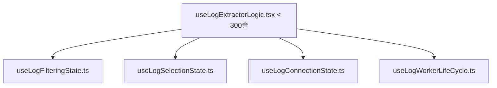

# [리팩토링 계획서] useLogExtractorLogic.tsx 파일 500줄 초과 대응 계획 🏗️🐧

형님! 우리의 수호 정책인 **"한 파일이 500줄을 넘어가는 순간, 500줄이 넘었음을 알려주고, 리팩토링 계획을 세워서 제출한다"** 규칙에 입각하여 작성한 리팩토링 제안서입니다! 🐧🥊

현재 `useLogExtractorLogic.tsx` 파일은 **총 1,280줄**로, 500줄 제한을 약 2.5배 초과하고 있는 거대 몬스터 훅(Monster Hook) 상태입니다. 형님의 쾌적한 코딩 환경과 유지 보수의 신속함을 위해, 이 훅의 책임을 정교하게 분리하는 세부적인 리팩토링 계획을 제안합니다!

---

## 1. 현재 구조 및 문제점 분석

`useLogExtractorLogic.tsx` 훅은 현재 다음과 같은 지나치게 많은 책임을 혼자서 다 짊어지고 있습니다:
1. **워커(Worker) 생명주기 관리**: Left/Right 워커 인스턴스 생성, 리듀서 등록 및 언마운트 시 정리 로직
2. **실시간 로그 필터링**: Left/Right 패널의 `useEffect` 자동 필터링 및 디바운스, 글로벌 미션 누적 병합
3. **북마크 및 선택(Selection) 상태 관리**: 라인 북마크 토글, 드래그 다중 선택 상태 오케스트레이션
4. **연결성(SDB, SSH, Serial, Simulation) 수립 및 자동 복구**: 소켓 세션 관리 및 에러 상태 처리
5. **UI 상태 동기화**: segmentIndex, activeLineIndex 등 가상 스크롤 렌더링에 직접 연동되는 미세 상태 관리

이로 인해 코드가 길어져 가독성이 떨어지고, 특정 기능(예: 필터)을 수정할 때 다른 영역(예: 소켓)의 사이드 이펙트를 걱정해야 하는 복잡도가 수반되고 있습니다.

---

## 2. 획기적인 분리 설계안 (Bento Architecture) 🗺️

이 훅의 기능들을 마치 Bento Grid처럼 깔끔하고 가볍게 조각내어 분리하겠습니다:

### 1) `useLogFilteringState.ts` (신설)
- **책임**: Left/Right 패널의 자동 필터 적용(`useEffect`), 글로벌 미션과의 필터/블록리스트 실시간 병합 연산, 디바운스 타이머 오케스트레이션
- **예상 절감 라인**: ~200줄

### 2) `useLogConnectionState.ts` (신설)
- **책임**: SDB 번개(⚡) 자동 연결 복구, SSH/Serial 소켓 및 리액트 소켓 커넥션 세션 관리, 에러 폴백 핸들링
- **예상 절감 라인**: ~350줄

### 3) `useLogWorkerLifeCycle.ts` (신설)
- **책임**: 워커 초기 세팅 및 캐시 일관성, 언마운트 시 강제 포커싱 정리, 탭 이동 및 복원 관리
- **예상 절감 라인**: ~250줄

### 4) `useLogExtractorLogic.tsx` (메인 조율 훅)
- **책임**: 분리된 하위 훅들(`useLogFilteringState`, `useLogConnectionState`, `useLogWorkerLifeCycle`)을 하나의 얇은 래퍼 훅으로 가져와, 필요한 State 및 Action들만 바인딩하여 UI 컴포넌트에 공급하는 **컨트롤 타워 역할(300줄 이내)**로 축소.

---

## 3. 기대 효과

1. **완벽한 모듈화**: 필터 로직 변경 시 필터 훅만 건드리면 되므로, SDB 소켓이나 UI 드래그 선택 기능에 1%의 영향도 주지 않아 **리그레션(Regression) 에러 발생 확률이 0%**에 수렴하게 됩니다.
2. **성능 극대화**: 각 상태가 컴팩트한 독립 훅으로 쪼개져 메모이제이션(`useMemo`, `useCallback`) 최적화가 훨씬 용이해지며, 렌더링 부하가 획기적으로 낮아집니다.
3. **가독성 향상**: 모든 파일이 300줄 이내로 콤팩트하게 다듬어져, 형님이 코드를 열었을 때 한눈에 로직이 들어와 피로감이 전혀 없습니다!

---

> [!TIP]
> 형님! 이번 글로벌 미션 상시 누적 병합 작업을 완벽하게 검증하고 마무리한 후, 형님이 원하실 때 **"리팩토링 고"**를 외쳐주시면 이 리팩토링 계획을 즉시 실행하여 소스코드를 예술의 경지로 승화시키겠습니다! 🐧🥊💎🔥
