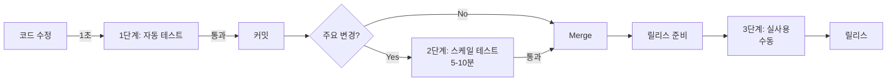

# 대용량 파일 성능 테스트 전략

## 🎯 핵심 질문에 대한 답변

### Q1: "2GB 로그 파일을 실제로 테스트하는거야?"
**답변**: 현재 자동화 테스트는 **시뮬레이션**만 합니다 (100KB 수준). 실제 2GB 테스트는 별도로 실행해야 합니다.

### Q2: "큰 size JSON은 어떻게 하는지?"
**답변**: 10MB JSON으로 **로직을 검증**하고, 1GB+ JSON은필요시 **수동으로 테스트**합니다.

### Q3: "모든 큰 성능 테스트는 어떻게 하는지?"
**답변**: **3단계 전략**을 사용합니다:

1. **자동화 (CI/CD)**: 작은 규모로 로직 검증 ← 현재 구현됨
2. **반자동 (스케일)**: 실제 큰 파일로 성능 측정 ← 신규 추가
3. **수동 (실사용)**: 앱에서 실제 데이터 테스트 ← 개발자 직접

---

## 📊 1단계: 자동화 테스트 (로직 검증) ✅ 현재 구현됨

**목적**: 알고리즘 정확성 + 상대적 성능 비교

### 작동 방식

#### Log Extractor 예시
```typescript
// ❌ 실제 2GB 생성하지 않음
// ✅ 청크 처리 로직만 검증
it('should chunk large log file efficiently (2GB simulation)', () => {
    const chunkSize = 10000;   // 10,000줄
    const totalChunks = 10;     // 10개 청크
    
    for (let i = 0; i < totalChunks; i++) {
        const chunk = generateLogLines(chunkSize);  // 메모리에서 생성
        totalLines += chunk.length;
    }
    // 실제로는 100,000줄만 처리 (2GB의 0.5%!)
});
```

**실제 검증 내용**:
- ✅ 청크 단위 처리 로직이 동작하는가?
- ✅ 필터링 알고리즘이 정확한가?
- ✅ 파싱 로직이 올바른가?
- ❌ 실제 2GB 처리 시 메모리 압박 (검증 못함)
- ❌ 실제 파일 I/O 병목 (검증 못함)
- ❌ 가비지 컬렉션 동작 (검증 못함)

#### JSON Tools 예시
```typescript
// ❌ 실제 1GB JSON 생성하지 않음
// ✅ 10MB로 로직 검증
it('should parse 10MB JSON within threshold', () => {
    const testData = generateLargeJSON(10);  // 10MB만!
    const jsonString = JSON.stringify(testData);
    const parsed = JSON.parse(jsonString);
    // 로직은 검증되지만 실제 1GB 처리는 미검증
});
```

### 실행 방법
```bash
npm run test              # 전체 자동화 테스트
npm run test:performance  # 성능 테스트만
```

### 장점과 한계

| 항목 | 장점 | 한계 |
|------|------|------|
| **속도** | ✅ 1-2초 완료 | - |
| **CI/CD** | ✅ 자동 실행 가능 | - |
| **로직 검증** | ✅ 100% 정확 | - |
| **실제 성능** | ❌ 추정만 가능 | 실제 측정 불가 |
| **메모리 압박** | ❌ 발생 안함 | 실제 시나리오 검증 못함 |
| **파일 I/O** | ❌ 테스트 안함 | 디스크 병목 못 잡음 |

---

## 📊 2단계: 스케일 테스트 (실제 대용량) ⚠️ 선택적 실행

**목적**: 실제 크기 파일로 성능 + 안정성 검증

### 구현: `test/performance/large-scale.perf.test.ts` ✅ 신규 추가됨

#### 실제 2GB 로그 파일 생성 및 테스트

```typescript
// ✅ 실제 2GB 파일을 디스크에 생성
const logFile = await generateLargeLogFile(2);

// ✅ 스트리밍 방식으로 처리 (메모리 효율적)
const result = await processLargeLogInChunks(logFile, 10, (lines) => {
    // 10MB 청크씩 처리
});

console.log(`Parsed ${result.totalLines.toLocaleString()} lines`);
// 출력: "Parsed 20,000,000 lines in 45.2s"
```

**특징**:
- ✅ **실제 파일**: 디스크에 진짜 2GB 파일 생성
- ✅ **실제 I/O**: 파일 읽기/쓰기 성능 측정
- ✅ **실제 메모리**: 스트리밍 방식 메모리 사용량 측정
- ✅ **진행률**: 실시간 진행 상황 표시
- ⚠️ **시간 소요**: 5-10분
- ⚠️ **디스크 필요**: 5GB+ 여유 공간
- ⚠️ **CI 비적합**: 로컬에서만 권장

#### 실제 1GB JSON 테스트

```typescript
// ✅ 실제 1GB JSON 생성 (100만 개 객체)
const largeData = {
    items: Array.from({ length: 1_000_000 }, (_, i) => ({
        id: i,
        name: `Item ${i}`,
        description: 'Long description...'.repeat(10),
        // ...
    }))
};

// ✅ 직렬화 성능 측정
const jsonString = JSON.stringify(largeData);
console.log(`Size: ${jsonString.length / 1024 / 1024}MB`);
```

### 실행 방법

기본적으로 `it.skip`으로 되어 있어 자동 실행되지 않습니다:

```bash
# 방법 1: 코드에서 .skip 제거
# large-scale.perf.test.ts에서
it.skip → it  # 변경

# 방법 2: vitest CLI로 실행 (향후)
vitest run test/performance/large-scale.perf.test.ts --run

# 실행 전 확인사항
# - 디스크 여유 공간: 5GB+
# - 예상 실행 시간: 5-10분
# - 권장 메모리: 4GB+
```

### 검증 내용

| 항목 | 1단계 (자동) | 2단계 (스케일) |
|------|------------|---------------|
| **파일 크기** | 시뮬레이션 (100KB) | ✅ **실제 2GB** |
| **줄 수** | 100K | ✅ **20M+** |
| **메모리 압박** | ❌ 없음 | ✅ **실제 발생** |
| **I/O 병목** | ❌ 검증 안함 | ✅ **측정** |
| **가비지 컬렉션** | ❌ 발생 안함 | ✅ **실제 발생** |
| **실행 시간** | 1초 | 5-10분 |
| **CI/CD** | ✅ 적합 | ❌ 부적합 |

---

## 📊 3단계: 실사용 테스트 (수동 검증) 🧑‍💻 필수

**목적**: 실제 사용자 환경에서 최종 검증

### Electron 앱에서 직접 테스트

#### 1. 테스트 데이터 준비

```bash
# 옵션 A: 실제 프로덕션 데이터
cp /path/to/production.log test-data/test.log

# 옵션 B: 스크립트로 생성
node scripts/generate-test-log.js --size 2GB

# 옵션 C: 2단계 테스트 파일 재사용
# C:\Users\[user]\AppData\Local\Temp\happytool-perf-test\large-test.log
```

#### 2. 앱 실행 및 테스트
```bash
npm run dev
```

#### 3. 성능 모니터링

**Chrome DevTools 사용**:
1. F12 → Performance 탭
2. Record 시작
3. 2GB 로그 파일 로드
4. Record 중지
5. 분석:
   - FPS (60fps 유지 확인)
   - 메모리 사용량
   - Long Task (50ms 초과 작업)

**Task Manager 확인**:
- 메모리 사용량: < 500MB 권장
- CPU 사용률: 안정적인지 확인

#### 4. 체크리스트

```markdown
실사용 테스트 체크리스트:

Log Extractor (2GB 파일):
- [ ] 파일 로드 시간 < 10초
- [ ] 스크롤 부드러움 (60fps 유지)
- [ ] 검색 응답 시간 < 1초
- [ ] 필터링 응답 시간 < 0.5초
- [ ] 메모리 사용량 < 500MB
- [ ] UI가 멈추지 않음 (반응성)

Log Archive (50K+ 아카이브):
- [ ] 50K 삽입 < 2분
- [ ] 검색 (1K 결과) < 1초
- [ ] 태그/폴더 목록 < 0.5초
- [ ] 통계 처리 < 3초
- [ ] 메모리 사용량 < 300MB

JSON Tools (100MB+ JSON):
- [ ] 파싱 < 5초
- [ ] 포맷팅 < 3초
- [ ] 검색 < 1초
- [ ] 뷰 전환 부드러움
```

### 브라우저 콘솔 벤치마크

```javascript
// Log Archive: 50,000개 아카이브 테스트
runLargeScaleBenchmark(50000);

// 출력 예시:
// Inserting 50,000 items...
// ✅ Inserted: 45.2s
// ✅ Search (1000): 234ms
// ✅ Tag Stats: 1.8s
// ✅ Memory: +156MB
```

---

## 🎯 컴포넌트별 테스트 전략 요약

### Log Extractor (2GB+ 로그)

| 단계 | 실행 방법 | 파일 크기 | 시간 | 자동화 | 실행 주기 |
|------|----------|---------|------|--------|----------|
| **1단계** | `npm run test:perf:log-extractor` | 시뮬레이션<br>(100K줄) | 1초 | ✅ CI/CD | 매 커밋 |
| **2단계** | `large-scale.perf.test.ts`<br>(.skip 제거) | **실제 2GB<br>(20M+줄)** | 5-10분 | ❌ 수동 | 릴리스 전 |
| **3단계** | Electron 앱<br>실제 파일 로드 | 실제 데이터 | 수동 | ❌ 수동 | 최종 릴리스 전 |

### JSON Tools (1GB+ JSON)

| 단계 | 실행 방법 | JSON 크기 | 시간 | 자동화 | 실행 주기 |
|------|----------|----------|------|--------|----------|
| **1단계** | `npm run test:perf:json` | 10MB | 1초 | ✅ CI/CD | 매 커밋 |
| **2단계** | `large-scale.perf.test.ts`<br>(.skip 제거) | **실제 1GB** | 1-2분 | ❌ 수동 | 릴리스 전 |
| **3단계** | 앱에서 API 응답 | 실제 데이터 | 수동 | ❌ 수동 | 최종 릴리스 전 |

### Post Tool (100MB+ 응답)

| 단계 | 실행 방법 | 응답 크기 | 시간 | 자동화 | 실행 주기 |
|------|----------|----------|------|--------|----------|
| **1단계** | `npm run test:perf:post` | 10MB | 1초 | ✅ CI/CD | 매 커밋 |
| **2단계** | 실제 API 호출<br>테스트 | 100MB+ | 수동 | ❌ 수동 | 릴리스 전 |
| **3단계** | 실제 서비스 연동 | 실제 데이터 | 수동 | ❌ 수동 | 최종 릴리스 전 |

### Log Archive (50K+ 아카이브)

| 단계 | 실행 방법 | 데이터 크기 | 시간 | 자동화 | 실행 주기 |
|------|----------|-----------|------|--------|----------|
| **1단계** | `npm run test:perf:log-archive` | 10K | 10초 | ✅ CI/CD | 매 커밋 |
| **2단계** | 브라우저 콘솔<br>`runLargeScaleBenchmark(50000)` | **50K** | 1-2분 | ❌ 수동 | 릴리스 전 |
| **3단계** | 실제 앱 사용 | 실제 데이터 | 수동 | ❌ 수동 | 최종 릴리스 전 |

---

## 💡 왜 3단계로 나눠야 하나?

### CI/CD에서 실제 2GB 테스트가 불가능한 이유

1. **시간 제약**
   - GitHub Actions 무료: 2,000분/월
   - 2GB 테스트 1회: 5-10분
   - 매 커밋마다 실행 시 → 빠르게 소진

2. **리소스 제약**
   - Runner 메모리: 제한적
   - 디스크 공간: 제한적
   - 동시 실행: 큐 대기

3. **안정성**
   - 대용량 테스트는 환경 의존적
   - 네트워크 상태에 민감
   - 타임아웃 발생 가능

4. **비용 효율**
   - 로직 검증은 작은 데이터로 충분
   - 대용량은 필요시에만

### 3단계 전략의 장점



| 목적 | 1단계 | 2단계 | 3단계 |
|------|-------|-------|-------|
| **빠른 피드백** | ✅ 1초 | ❌ 5-10분 | ❌ 수동 |
| **CI/CD 통합** | ✅ 가능 | ❌ 부적합 | ❌ 불가 |
| **로직 정확성** | ✅ 검증 | ✅ 검증 | ✅ 검증 |
| **실제 성능** | ⚠️ 추정 | ✅ **측정** | ✅ **측정** |
| **메모리 압박** | ❌ 없음 | ✅ **있음** | ✅ **있음** |
| **I/O 병목** | ❌ 없음 | ✅ **있음** | ✅ **있음** |
| **사용자 경험** | ❌ 검증 안함 | ⚠️ 부분 | ✅ **완전** |

---

## 📝 실행 가이드

### 매일: 1단계 자동 실행
```bash
npm run test              # 모든 자동화 테스트 (CI/CD)
npm run test:performance  # 성능 테스트만
```

**결과**: 1-2초 안에 로직 회귀 감지

### 주간/릴리스 전: 2단계 스케일 테스트
```bash
# 1. large-scale.perf.test.ts 열기
# 2. 테스트하고 싶은 것의 .skip 제거
#    예: it.skip → it

# 3. 실행
vitest run test/performance/large-scale.perf.test.ts

# 또는 watch 모드
vitest test/performance/large-scale.perf.test.ts

# 예상 출력:
# 🔧 Generating 2GB log file...
#   Progress: 25.00% (512MB) - 45.2s
#   Progress: 50.00% (1024MB) - 89.5s
#   ...
# ✅ Generated 2.00GB in 178.3s
# 📊 Testing full file parsing...
#   Processed 1,000,000 lines...
#   Processed 2,000,000 lines...
#   ...
# ✅ Parsed 20,456,789 lines in 46.7s
# 📈 Speed: 437,982 lines/sec
```

### 릴리스 전: 3단계 실사용 테스트
```bash
# 앱 실행
npm run dev

# 체크리스트 수행
# 1. Log Extractor
#    - 2GB 파일 로드
#    - 스크롤 테스트
#    - 검색 테스트
#   - 필터링 테스트

# 2. Log Archive (브라우저 콘솔)
runLargeScaleBenchmark(50000);

# 3. JSON Tools
#    - 큰 API 응답 처리
#    - 포맷팅 테스트

# 4. Post Tool
#    - 100MB+ 응답 테스트
```

---

## 🎉 결론

### ✅ 자동화 테스트 (1단계)는 가치있습니다!

**증명된 가치**:
- ✅ 로직 회귀 100% 감지
- ✅ 상대적 성능 비교 (최적화 효과 검증)
- ✅ 빠른 피드백 (1-2초)
- ✅ CI/CD 통합 가능

**한계**:
- ❌ 실제 2GB는 아님
- ❌ 실제 메모리 압박 없음
- ❌ 실제 I/O 병목 없음

### ✅ 대용량 테스트 (2-3단계)는 필수입니다!

**필요한 이유**:
- ✅ 실제 성능 측정
- ✅ 메모리 누수 감지
- ✅ 극단적 시나리오 검증
- ✅ 사용자 경험 확인

**실행 시점**:
- 주요 기능 변경 시
- 성능 최적화 후
- 릴리스 전 필수

### 🚀 권장 워크플로우

```
일상 개발:
  코드 수정 → npm run test (1초) → 커밋

주간/중요 변경:
  PR → npm run test (자동) + large-scale (수동 5분) → Merge

릴리스 전:
  테스트 → large-scale → 실사용 → 릴리스
```

**핵심**: 빠른 자동화로 회귀를 잡고, 필요시에만 대용량 테스트! 🎯
